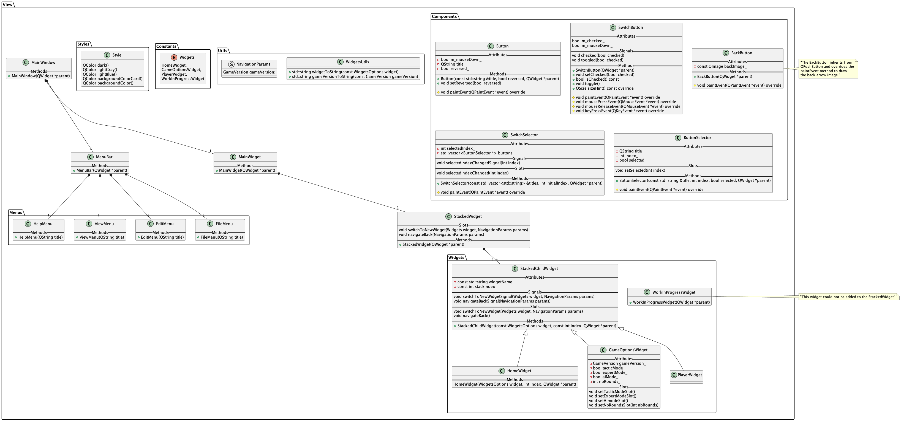
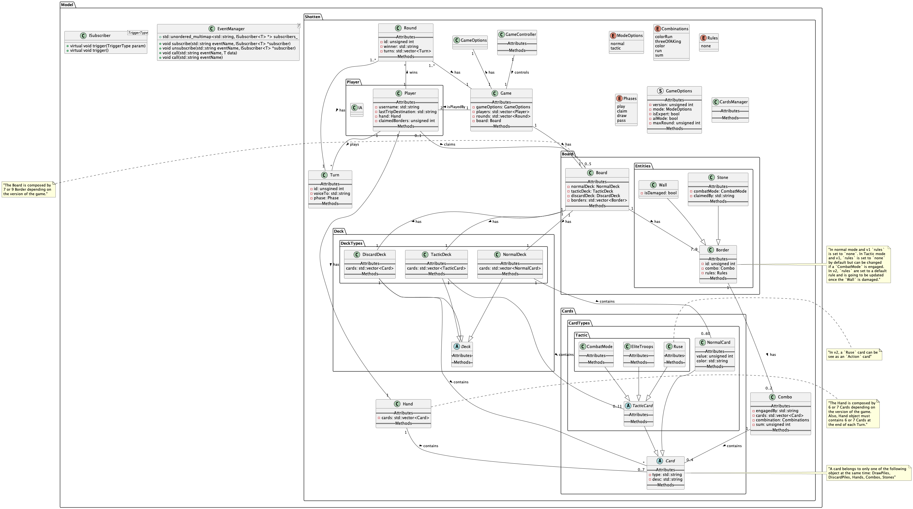

# Projet LO21 – Schotten-Totten


## Objectif

Implementer en C++ une application 'Desktop' qui permet de jouer au jeu Schotten-Totten aussi bien dans sa version 1 que 2. Il s'agira en premier lieu d'implémenter la version 1 tout en préparant l'implémentation de la version 2.


## Membres

* Justine POUGET
* Axel CAMPAÑA
* Gabriel Santamaria
* Pierre ROUSSEL
* Yicheng WAMG


## Liens utiles

  * [Wireframe collaboratif](https://md.picasoft.net/s/rl-nCqa_b)
  * [Diagramme de classe backend collaboratif](https://md.picasoft.net/s/iOrM9CnNx)
  * [Diagramme de classe frontend collaboratif](https://md.picasoft.net/s/2JaoZ9J2i)


## Etude du jeu, de ses versions et de ses concepts


### Schotten-Totten_v1

Dans sa version initiale, le Schotten-Totten nous propose une version 1v1 se présentant sous la forme d'un plateau de jeu séparé par une frontière. L'objectif principal pour gagner la partie est de remporter un nombre de manche prédéfini en prenant le contôle de la frontière. Pour se faire les joueurs vont devoir s'affronter de part et d'autre de la frontière en posant des **combinaisons de 3 cartes** le long de la frontière. L'endroit où les combinaisons s'affrontent est plus communément appelé `Bornes` (**9 `Bornes` composent la frontière**). Le joueur ayant la combinaison la plus forte (sans notion d'ordre) remporte la `Bornes`. La frontière est considérée comme contrôlée dès lors qu'un joueur remporte **5 `Bornes` quelconques** ou **3 `Bornes` adjacentes**. Lorsqu'un joueur remporte une manche, il marque alors 5 points et son adversaire remporte autant de points qu'il contrôle de `Bornes`.  
Dans cette version, chaque joueur de la partie est soumis aux mêmes règles. Tour à tour, ils vont tenter de former leurs combinaisons pour battre celles de l'adversaire – il est alors possible de considérer chaque joueur comme un attaquant.  
Le déroulement du jeu varie en fonction du mode de jeu choisi:


#### Mode NORMAL

En mode NORMAL, pour former ses combinaisons, un joueur dispose de **6 cartes en main**. Ces cartes sont appelées `Cartes Clan` (au nombre de 54). Elles possèdent une **couleur (parmi 6)** ainsi qu'une **valeur (comprise entre 1 et 9)**.  
Pour jouer un tour, un joueur doit poser une `Cartes Clan` de son côté de la frontière et le long d'une `Bornes`. Il peut ensuite choisir de **revendiquer** la `Bornes` si sa combinaison est plus forte que celle de l'adversaire ou s'il peut prouver qu'elle sera plus forte – ayant connaissance de sa main et des cartes déjà engagées sur le plateau. Une `Bornes` revendiquée passe alors sous le contrôle du joueur et ne peut plus être jouée. Enfin, il doit piocher une carte dans la pioche pour clore son tour.


#### Mode tactique

En mode tactique, la disposition du plateau de jeu diffère légèrement. En effet, le nombre de cartes en main passe au nombre de 7 (au lieu de 6) et une deuxième pioche ainsi qu'une défausse font leur apparition. Il s'agit de la pioche de `Cartes Tactique` (au nombre de 10). Ces cartes peuvent être regroupées sous forme de trois sous-groupes:


##### **Toupes Elites**

Ces cartes se jouent comme les `Cartes Clans` et sont au nombre de 4:
  * Joker (x2) – Elle permet de choisir une carte de couleur et de valeur quelconque. Un joueur ne peut jouer deux fois cette carte durant une manche. Dans le cas où cette carte serait piochée une deuxième fois, il devra la conserver jusqu'à la fin de la manche.
  * Espion – Elle a pour valeur 7 et une couleur quelconque.
  * Porte-Bouclier – Elle a la capacité de prendre une valeur comprise entre 1 et 3 et une couleur quelconque.


##### **Modes de Combat**

Ces cartes se jouent par-dessus une `Bornes` et change les règles de revendication localement à la `Bornes`. Elles sont au nombre de 2:
  * Collin-Maillard – Elle force la somme des cartes et ne prend plus en compte les combinaisons.
  * Combat de Boue – Elle force la pose de 4 cartes.


##### **Ruses**

Ces cartes sont à l'origine de la création de la défausse. Elles se jouent en amont du tour pour en modifier sont déroulement. Elles sont au nombre de 4:
  * Chasseur de Tête – Elle permet au joueur de piocher 3 cartes (de n'importe quelle pioche) et de n'en conserver qu'une en main; les autres cartes repartant au bas de leur pile respective.
  * Stratège – Elle permet de replacer une carte déjà engagé dans une de ses combinaisons pour la replacer dans une autre. La `Bornes` ne peut être revendiqué pour pouvoir déplacer la carte.
  * Banshee – Elle permet de supprimer une carte d'une combinaison adverse en la placant directement dans la défausse. La `Bornes` ne peut être revendiquée pour pouvoir supprimer la carte.
  * Traître – Elle permet de subtiliser une carte d'une combinaison adverse et de la placer dans une de ses combinaison. La `Bornes` ne peut être revendiquée pour pouvoir subtiliser la carte.

**Note:** Aucun des joueurs des la partie n'est autorisé à jouer **2 `Cartes Tactique` de plus** que l'autre joueur.


#### Mode expert

Le mode expert est un mode de jeu visant à réorganiser le déroulement d'un tour. Dans ce mode le joueur doit revendiquer sa `Bornes` avant de poser une carte. Ce mode de jeu peu être appliquer aussi bien en mode `NORMAL` qu'en mode `tactique`.


### Schotten-Totten_v2

Dans la deuxième version de Schotten-Totten, il s'agit toujours d'un jeu de plateau séparé par une frontière. Cependant dans cette version il ne s'agit plus d'une frontière composée de `Bornes` mais de `Murailles` (**7 `Murailles` composent la frontière**). Les `Murailles` délimite l'intérieur du château de l'extérieur. Dans cette version du jeu il ne s'agit plus de 2 attaquants qui se disputent la frontière mais d'un attaquant qui tente de prendre le contrôle du chateau et d'un défenseur qui cherche à le défendre. Les `Murailles` ont désormais des états (neuves et endommagés) des propriétés qui vont définir les règles locales à appliquer sur la dites `Murailles`. Les propriétés modifiées peuvent être le nombre de cartes comme les priorités sur les combinaisons gagnantes.


#### Mode NORMAL

En mode NORMAL, pour faire ses combinaisons, un joueur dispose de **6 cartes en main**. Ces cartes sont appelées `Cartes Siège` (au nombre de 60). Elles possèdent une **couleur (parmi 5)** ainsi qu'une **force (comprise entre 0 et 11)**.


##### **Côté attaquant**

L'objectif de l'attaquant est de revendiquer 4 `Murailles` endommagées ou de revendiquer 2 fois la même `Murailles`. Si cela arrive, la partie prend fin.  
Lors de son tour, l'attaquant peut et/ou doit:
  * Battre en retraite – Cela donne la possibilité à l'attaquant de retirer le(s) carte(s) de son choix de(s) `Murailles` de son choix
  * Jouer une carte – Sur l'une des `Murailles` de son choix
  * Piocher une carte
  * Revendiquer une `Murailles` – Cela permet de prendre le contrôle d'une `Murailles`


##### **Côté défensseur**

L'objectif du défensseur est de défendre la `Murailles` des attaques de son adversaire en formant de meilleures combinaisons. Le défensseur remporte la manche lorsque la pioche vient à être vide.  
Lors de son tour, le défenseur peut et/ou doit:
  * Jeter un chaudron d'huile – Au nombre de 3, ils permettent de défausser la carte la plus proche de la `Murailles` de son choix
  * Jouer une carte – sur l'une des `Murailles` de son choix
  * Piocher une carte

**Note:** Comme pour la version initiale, lorsque l'adversaire veut revendiquer une `Murailles`, il doit avoir une combinaison plus forte que celle de son adversaire ou être en mesure de prouver à son adversaire que sa combinaison sera plus forte que celle de son adversaire.


#### Mode tactique

Comme pour la version initiale, en mode tactique la disposition du plateau change légèrement. Comme pour la version initiale, les joueurs disposent de 7 cartes en main (au lieu de 6) et une deuxième pioche ainsi qu'une défausse font leur apparition. Cette nouvelle pioche est elle aussi composée de `Cartes Tactique` (au nombre de 11).  
Ces cartes peuvent être regroupées en deux catégories:


##### **Toupes Elite**

Ces cartes se jouent comme des `Cartes Siège` et sont au nombre de 4:
  * Joker (x2) – Elle permet de choisir une carte de couleur et de valeur quelconque.
  * Espion – Elle a pour valeur 7 et une couleur quelconque.
  * Porte-Bouclier – Elle a la capacité de prendre une valeur comprise entre 1 et 3 et une couleur quelconque.


#### **Actions**

Ces cartes sont à l'origine de la création de la défausse. Elles se jouent en amont du tour pour en modifier sont déroulement. Elles sont au nombre de 7:
  * Redéploiement – Cette carte permet de déplacer une carte engagée dans une de ses combinaison sur une autre `Murailles` ou dans la défausse
  * Recrutement – Cette carte permet de choisir une carte défaussée et de la ré-engager dans une de ses combinaisons
  * Disertion – Cette carte permet de défausser une carte engagée dans une combinaison adverse
  * Traîtrise – Cette carte permet de subtiliser une carte engagée dans une combinaison adverse et de la placer dans une de ses combinaisons
  * Explosion – Cette carte permet de défausser toutes les cartes engagées dans une combinaison le long d'une `Murailles`
  * Soutient – Cette carte permet de remettre 2 cartes défaussées dans la pioche. Cette carte ne peut être jouer tant que la pioche n'a pas au moins 2 cartes.
  * Echange – Cette carte permet de choisir 3 cartes dans sa main respective et de les échanger avec l'adversaire

**Note:** Aucun des joueurs des la partie n'est autorisé à jouer **2 `Cartes Tactique` de plus** que l'autre joueur.


### Combinaisons

Dans ce jeu, la liste des combinaison possible sont les suivantes:
  1. Suite couleur – Trois cartes de la même couleur et de trois valeurs successives
  2. Brelan – Trois cartes de la même valeur
  3. Couleur – Trois cartes de la même couleur
  4. Suite – Trois cartes de valeurs successives
  5. Somme – Trois cartes quelconques


### Les concepts

Que ce soit dans la verion initiale ou revisitée, le jeu propose un concèpte de stratégie où les deux adversaires cherchent à prendre le contrôle d'une frontière. Afin de prendre le contrôle de celles-ci, il s'agit de poser de son côté de la frontière des combinaisons de cartes qui seront meilleures que celles de l'adversaire.  
Dans la version initiale, les deux deux joueurs peuvent être considés comme des attaquants. Ils sont tous deux soumis aux mêmes règles de déroulement d'un tour.  
Dans la deuxième version du jeu les joueurs sont plutôt à considérer comme attaquant/défenseur. Les règles de déroulement d'un tour diffère en fonction du rôle occupé. Notamment la première phase du tour et la dernière phase.  
Il est possible de noter que dans la première version et la deuxième, les tuiles diffèrent dans leur représentation. En effet, les tuiles de la deuxième version possèdent des propriétés pouvant imposer certaines formes de combinaison. Cependant, cette représentation peut se rejoindre car grâce aux `Cartes Tactique` de catégorie `Mode de Combat`, il est possible de donner des propriétés spécifiques aux tuiles de la frontière. Il faudra donc être en mesure de donner une représentaion suffisamment large pour gérer celà.  
De même, la manière dont le joueur dont le joueur intéragit avec le plateau de jeu reste commune, dans les deux versions le joueur doit être capable de poser des cartes sur une frontière, piocher et revendiquer une tuile de la frontière. En fonction du mode de jeu et/ou de la version du jeu, le joueur doit être en mesure de pouvoir déplacer des cartes sur le platau. Par exemple, en `mode tactique` dans la version initiale les joueurs doivent être capable de déplacer une carte déjà engagée dans une combinaison. Cette carte peut être d'une combinaison du joueur comme de l'adversaire et peut se retrouver dans une combinaison du joueur ou dans la défausse. On retrouve aussi ce concept dans la deuxième version du jeu avec les actions de début de tour. L'attaquant est capable de `Battre en retraite` et le défenseur de `Jeter un chaudron d'huile`.  
Pour se focaliser plus sur les cartes, il est nécessaire de prendre en compte que les cartes communes (`Cartes Clans` ou `Cartes Siège`) ont une valeur ainsi qu'une couleur. Pour les `Cartes Tactique`, il faut noter que ces dernières se jouent à des endroits différents et ont des propriétés différentes. Les `Troupes Elite` se jouent de la même manière et ont les mêmes propriétées que les cartes communes à la différence que leurs attributs (valeur et/ou couleur) peuvent être défini. Les `Modes de Combat` modifient les propriétés des tuiles localement. La tuile une fois modifiée peut être assimilé à une `Murailles` dans la deuxième version. Il faut donc prévoir des fonctionnalités qui permettent de modifier les propriétées en fonction des besoins. Enfin, les cartes `Ruses` tout comme les cartes `Actions` se jouent dans la défausse et modifie le déroulement d'un tour ainsi que les actions possible pour un joueur.  
Dans chaque version, il faudra être en mesure de comparer deux combinaisons entre elles en fonction des propriétées de la tuile. Il faudra aussi prévoir les règles d'égalité de combinaison qui vont forcer à sommer les valeurs des cartes composant la combinaison. En cas de nouvelle égalité, il faudra pouvoir déterminer quel joueur à completer en premier sa combinaison.  


## Structuration et organisation du projet

Le projet sera hébergé sur GitHub et sera suivi via la fonctionnalité `Project`. Le projet sera divisé en `Issues` qui seront assignées aux membres du groupe.  


### Les issues

Chaque issue suivera le workflow suivant avec ces différents statut:  

  - `To do` – Ce statut défini la liste des tâches toujours à réaliser  
  - `In Progress` – Ce statut défini la liste des tâches en cours de réalisation  
  - `Staging` – Ce statut défini la liste des tâches qui sont réalisées et tester spécifiquement lors de l'implémentation  
  - `Done` – Ce statut défini la liste des tâches finies qui sont testés et considérés comme fiable  

Dans le projet, chaque tâche pourra être priorisé grace à un attribut dans l'issue. Ils pourront aussi être prioriser par le ordre d'apparition dans les `Backlogs`.  
Un suivi des issues qui sont assignées sera possible grâce à la view `My issue`.  
La branche `main` sera la branche principale du projet et servira pour le code considéré comme fiable. La branche `staging` sera celle où les tâche sont réalisées mais pas entièrement testées. Les autres branches seront les branches de developpement et porteront comme nom la clé du ticket (à voir si réalisable).  

Lien vers le projet -> [schotten-totten](https://github.com/orgs/lo21-p23-project/projects/1/views/1)


### Les vues

Pour voir l'ensemble des tâches, il est possible de consulter le tableau [Board](https://github.com/orgs/lo21-p23-project/projects/1/views/1) qui donne une vue d'ensemble de l'avancement du projet.  
De même, la vue [Backlog](https://github.com/orgs/lo21-p23-project/projects/1/views/2) donne une version d'ensmble des tâches à réaliser. Cette vue à pour objectif principal de prévoir tout en priorisant les tâches à réaliser en fonction des besoins à un instant t.  
La vue [My issues](https://github.com/orgs/lo21-p23-project/projects/1/views/3) permet de voir les tâches qui nous sont assignées. Seules les tâches ayant le statut `To do`, `In Progress`,  `In Review` ou `Staging` sont affichées.  
La vue [Staging](https://github.com/orgs/lo21-p23-project/projects/1/views/6) et [Done](https://github.com/orgs/lo21-p23-project/projects/1/views/5) permettent de voir l'ensemble des tâches qui sont considérées comme finies (même si non testé hors developpement).  


## Code guidelines

L'entièreté des codes guidelines se trouvent dans le fichier `.clang-format` à la racine du projet. Avant de faire une `Pull Request`, vérifiez que votre code est conformes aux guidelines.  

Nous avons mis à la disposition de tous un script `Powershell` qui se trouve aussi à la racine du projet (`run-clang.ps1`) pour vous permettre de formatter le code que vous venez d'écrire avant de le publier.  

- Dans tout le projet, on essaiera au plus que possible d'utiliser les possibilités du C++ moderne en utilisant des pointeurs intelligents et les conteneurs disponibles dans la STL.  


## Conception et architecture du projet


### Le projet `git`

Nous avons mis en place une repository avec `Git` pour faciliter les contributions entre tous les membres du projet. Le projet est hébergé sur Github, à l'adresse suivante: https://github.com/lo21-p23-project/lo21-project.  

Grâce à Github, nous avons mis en place un système de gestion des tâches basées sur des `Issues`. Pour chaque tâche à faire:  

- Elle est d'abord décrite de manière précise dans un ticket  
- Elle est ensuite assignée à une personne du projet souhaitant la prendre en charge  
- Elle est finalement mise dans le backlog  

Cela nous permet de garder un oeil sur les tâches qu'il nous reste à faire et celles que nous avons déjà accomplies.  


### Les Github Actions

Grâce à Github Action, nous avons pu mettre en place un flow de validation des pull request de chacune des branches qui sont crées, avant de les mettre dans la branche principale.  


#### clang-format

L'une de ces deux actions est le formattage du code, pour assurer un code qui soit homogène et que les conventions soient les même pour tous. Nous avons aussi développé un petit script Powershell pour permettre à tout le monde de formatter le code avant de le push sur le dépôt.  

L'action `clang-format` s'exécute à chaque pull request dans la branche `staging` ou `main`.  


#### continuous integration (build)

Pour être sûr que les codes qui seront merge dans la branche principale ou de staging ne soient pas défectueux, nous avons aussi mis en place un système de `CI` pour valider que le code qui a été publié compile bien sur les plateformes principales (linux, windows et macos).  

Cette action a été quelque peu difficile à mettre en place, au vu de la complexité de l'installation et de la compilation de projets qui utilisent le framework Qt. Elle n'est pour le moment pas encore fonctionnelle, mais nous espérons pouvoir la mettre en place avant la fin du projet.  


### Choix du design pattern

Le projet a été designé en utilisant deux design-pattern. Le premier, qui nous sert à bien utiliser Qt et séparer les mondes de *l'UI* et du *backend* est le MVC:
vous trouverez à la racine source du projet (*src/*) trois dossiers: **Model**, **Controller** et **View**.  

- Dans **Controller** se trouve le code qui nous permet de faire l'interface entre notre modèle et notre vue. Les classes qui y sont présentes sont en grande majorité statiques, et ne servent qu'à faire le lien entre les deux mondes.  
- Dans **View** se trouve l'entièreté du code d'affichage du projet qui utilise le framework *Qt* en version *6.5.0*. Tout le code spécifique à *Qt* (ou qui utilise des objets *Qt*) se trouve dans *src/View*.  
- Dans **Model** se trouve le code du backend. Toute la logique du code (sur laquelle s'appuient les vues) est contenu dans le dossier *src/Model*.  


#### Côté frontend  
\
La partie frontend du projet utilise le design pattern Observer puisque le framework Qt repose entièrment sur ce design pattern.  

Le répertoire View se décompose lui-même en plusieurs modules:  
  - Les components: Ce sont les composants de base de l'application, ils sont réutilisables et peuvent être appelés dans n'importe quelle vue et/ou autre component. Ils permettent de garder un design cohérent à travers toute l'application.  
  - Les widgets: Ce sont les vues de l'application, elles sont composées de components et de widgets.  
  - Les constantes: Ce sont les constantes de la partie frontend. Elles permettent par exemple de simplifier la logique de navigation entre les vues.  
  - Les utils: Ce sont des fonctions utilitaires qui permettent d'effectuer des actions récurrentes dans l'application.
  - Les styles: Ce sont les couleurs et polices utilisées dans l'application. Tout comme les components, les styles permettent de garder un design cohérent à travers toute l'application.  
  - Les composants de base: A la racine du dossier View se trouvent les composants de base de l'application. Ils correspondent à la logique principale de la partie frontend de l'application.  


##### Logique de création des vues
\
Afin de créer les vues, il suffit d'utiliser une `QMainWindow` qui sera la fenêtre principale de l'application. Afin de permettre à l'application de montrer différentes vues, il faut aussi créer un `MainWidget` qui permettera de contenir les différentes vues à afficher et à cacher en fonction du workflow de l'application.

##### Logique de navigation entre différentes vues
\
Bien que le modèle précédent nous permettent de créer une pseudo logique de navigation entre les vues, il est cependant très peu pratique à utiliser et à maintenir. Dans l'objectif de palier à cela, nous avons utilisé un `QStackedWidget` qui permet de gérer la navigation entre les différentes vues de manière plus simple et plus maintenable. La classe `StackedWidget` possède des slots (`switchToNewWidget()` et `navigateBack()`) qui reste à l'écoute des signaux des vues qu'il contient.  
Aussi toute vue, héritera de la classe `StackedChildWidget` qui possède des slots (`switchToNewWidget()` et `navigateBack()`) et des signaux (`switchToNewWidgetSignal()` et `navigateBackSignal()`) permettant de naviguer entre les différentes vues. Cette classe possède aussi un attribut `widgetName` qui permet d'identifier la vue et un attribut `stackIndex` qui permet de définir l'index de la vue dans la `QStackedWidget`.  
Afin de garder une flexibilité dans le code, la `StackedWidget` créera la vue et l'ajoutera à la `QStackedWidget` lors de l'appel du slot `switchToNewWidget()`. Lors de l'appel du slot `navigateBack()`, la `StackedWidget` supprimera la vue de la `QStackedWidget` et la détruira.  
Par défaut, la `StackedChildWidget` possède un bouton de retour qui permet de naviguer vers la vue précédente.  

**Pour plus d'informations, il est possible de consulter le diagramme de classe frontend.**




#### Côté backend  
\
Nous avons pris le choix d'avoir un backend qui utilise le design pattern Observer. Pour la mise en place de ce design pattern, vous trouverez deux classes:  

- `EventManager`: une classe qui s'occupe de gérer la levée des évènements dans le code  
- `ISubscriber`: une classe qui décrit le fonctionnement des objets qui s'abonnent à certains évènements  

##### Fonctionnement et utilisation de ces deux classes  
\
Il s'agit ici de décrire le fonctionnement de ces deux classes, et de montrer comment les utiliser.  


###### Utilisation  

L'utilisation de ces deux classes est assez directe: soit `A` et `B` deux classes, et supposons que nous souhaitons que `B` puisse recevoir des messages de la part de `A`.  

A titre d'exemple, les messages que s'échangent `A` et `B` sont des entiers.  

Tout d'abord, nous devons permettre à `B` de souscrire à des évènements:  
```cpp
using namespace Model::Shotten;

class B : ISubscriber<int> {
  /* ISubscriber est une classe virtuelle définie dans Model::Shotten */

public:
    void trigger(int message) {
        std::cout << "Message reçu: " << message << std::endl;
    }
    
    void trigger() {
        std::cout << "Evenement recu sans message" << std::endl;
    }
}
```

Ensuite, nous devons ajouter à `A` la possibilité d'envoyer des messages à `B`. Pour se faire, il nous suffit d'ajouter un attribu à `A` qui gère les messages envoyés vers `B`:  

```cpp
using namespace Model::Shotten;

class A {
public:
    EventManager<int> bEventManager;
}
```

Pour faire en sorte que `B` souscrive à `bEventManager`, un simple:

```cpp
    auto bInstance = std::make_shared<B>();
    bEventManager->subscribe("name_of_the_event", bInstance);
```

Ensuite, pour que `B` reçoive un message lorsque l'évènement `name_of_the_event` est trigger, il suffit de faire:

```cpp
    bEventManager->call("name_of_the_event", 12);
    /* cet appel à call fait que B::trigger(12) est appelé */
```

###### Fonctionnement  

`EventManager` maintient une collection d'abonnés, qui sont tous des instances d'objets qui implémentent l'interface `ISubscriber`. `EventManager` est générique, ce qui lui permet de gérer différents type de données de message.  

Voici une courte description de ce que fait chaque méthode dans `EventManager`:  

- `subscribe`: Cette méthode ajoute un nouvel abonné à un événement spécifique. Chaque événement est identifié par une chaîne de caractères, et un abonné peut s'abonner à autant d'événements qu'il le souhaite.  

- `unsubscribe`: Cette méthode retire un abonné d'un événement spécifique. Si l'abonné n'est pas dans la liste pour cet événement, rien ne se passe.  

- `call`: Ces méthodes sont utilisées pour déclencher un événement. Lorsqu'un événement est déclenché, tous les abonnés à cet événement sont notifiés et leur méthode trigger est appelée. Il y a deux versions de cette méthode, une qui prend une donnée de type T qui est passée aux abonnés, et une autre qui ne prend rien.  

`ISubscriber` est une interface pour les objets qui peuvent s'abonner aux événements gérés par un `EventManager`. Un objet qui implémente `ISubscriber` doit fournir une méthode `trigger`, qui sera appelée par `EventManager` lorsqu'un événement auquel l'objet est abonné est déclenché.  

La méthode `trigger` a deux formes: une qui prend un argument de type `TriggerType` (le type de donnée pour les messages) et une qui n'en prend pas.  

##### Pourquoi utiliser cette architecture?  
\
L'Observer nous permet de mettre une couche d'abstraction supplémentaire sur nos objets et de ne plus trop se préoccuper de la manière dont les objets sont communiquent des données entre eux.  

A partir du moment où l'on a besoin d'une communication, il nous suffit de mettre en place un canal en utilisant les classes `ISubscriber` et `EventManager`, et le tour est joué!  

De plus, le jeu vidéo étant un domaine beaucoup basé sur les évènements, mettre en place un tel système paraît presque naturel.  

A noter qu'un tel système pour le *Shotten-Totten* n'est pas entièrement requis. Néanmoins, le découpage que nous avons fait nous permets de pouvoir changer les Vues sans impacter le code des Modèles, ou encore de changer la logique interne du modèle, sans avoir à toucher au Vues.  

**Pour plus d'informations, il est possible de consulter le diagramme de classe backend.**



### Wireframe  

[-> Lien](https://md.picasoft.net/s/rl-nCqa_b)

### Diagramme de classe  

[-> Frontend](https://md.picasoft.net/s/2JaoZ9J2i)  
[-> Backend](https://md.picasoft.net/s/iOrM9CnNx)